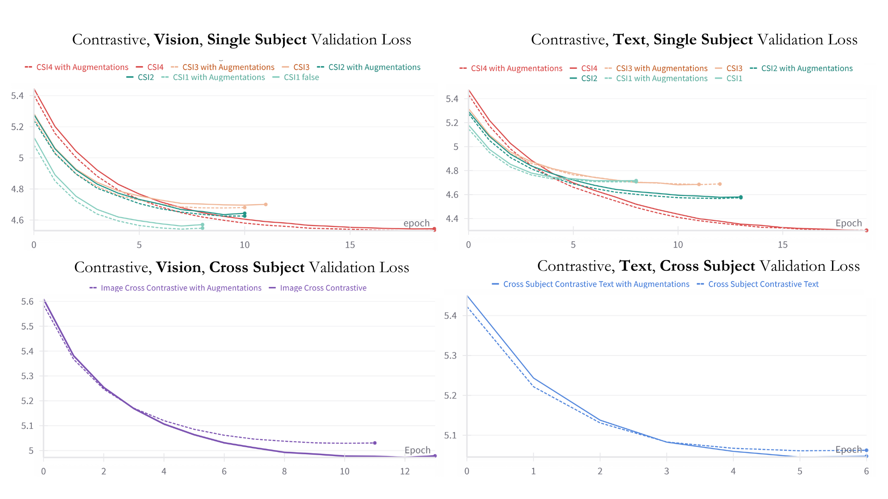

## Semantic Alignment of fMRI Data Using CLIP
Objective: Explore and understand the provided fMRI dataset to perform CLIP-based contrastive tuning. The goal is to align the fMRI data with semantic information derived from images or textual descriptions effectively. 

## Strategy: Understand data and contrastive learning

In the *Understand_data.ipynb* I run the initial analysis of the dataset.
I'm using preprocessed GLM outputs of fMRI data obtained using GLMsingle fMRI timeseries into responses to individual stimuli image.

Perform decoding from fMRI data poses different challenges:

1) fMRI data are spatiotemporal **noisy** high dimensional data. Moreover, the signal in time is spread and delayed since we're not measuring the true underlying neural activity, but an indirect measures of it trought the BOLD signal. To deal with this issues, I'm using the GLM betas coefficient to get rid of the temporal dynamics since in this dataset the stimuli are still images. 
To reduce complexity due to high dimensionality I'm building an encoding model to estimate brain activity from CLIP image embeddings. By measuring correlation on some held-out data I can identify visual responding region and select them for further analysis.

2) I'm training a baseline linear decoding model to assess the amount of information that can be extracted from fMRI data processed in this way.

3) fMRI data shows high inter subject variability and this poses challenges to train large models able to generalize across different subjects. To deal with this issue, I'm building an hybrid neural network, where the first layer is subject-specific and the rest of the network is shared across subject. In this way we can leverage the full dataset for training and the first layer will align different subject into a common latent space. This part of the code is in the *contrastive_learning.ipynb* notebook, where I'm optimizing the neural architecture performing contrastive learning between fMRI and visual representations.

**Evaluation** 
What we want from a model like this is something that is able to map neural represantions into semantic ones. It's not just about the value of the loss function and a rigorous evalaution is needed. I'm evalauting decoding performances measuring Top1,Top5 and Identification accuracy to better assess the quality of the model.

## Repository Organization

1) **Understand_data**.ipynb: This is the first notebook to run. Here, fMRI data are loaded. splitted and standardized. A linear encoding model is trained to predict areas of the brain responsive to semantic visual features extracted from CLIPVision. By measuring the correlation on the *validation set* the Top N (N=10k) voxels are selected for subsequent analysis. To perform an initial quality check, a linear decoding model is fitted to predict image features from brain activity, measuring retrieval performances.

2) **generate_captions**.ipynb: Since the BOLD5000 contains image from multiple sources (ImageNet, COCO and SUN) captions are not immediately available for all the images and can be written by different annotators. To armonize everything, the GIT captioning model is used to caption all the images.

3) **encoding_text**.ipynb is a notebook mirroring the same ideas of Understand_data.ipynb, but instead of using image features, it relies on text features extracted by CLIPText encoder.

4) **contrastive_learning**.ipynb: This is an optimization notebook. Here a multisubject neural network is trained with a contrastive learning objective. Random search is used to explore hyperparameter impact on performances, Top1, Top5, Identification accuracy are used as metric to assess quality of decoding performances on the *validation set*.

5) **braintuning_image**.ipynb: This is the main notebook. Based on the optimal hyperparameters found in the previous notebook, a final model is trained to predict image features from brain activity with a contrastive learning objective. Performances are evaluated on the *test set*. 

6) **braintuning_text**.ipynb: This is a specular notebook, doing the same thing as braintuning_image but on text features. Performances are evaluated on the *test_set*. 

7) **braintuning_multi**.ipynb: Here the image and text model are trained separately, but their predictions are concatenated before evaluation

8) **augmentations**.ipynb: This notebook leverage NSD Image data and encoding model to produce data augmentations for furhter analysis. Common images between BOLD5000 test set and NSD training data are filtered out.

9) All _singlesubject and _augmented notebooks are just experiments with same underlying code as respective contrastive changing these parameters.

10) **evaluate_linear**.ipynb train and evaluate regression based decodinng models

11) **aggregate_results**.ipynb just collects all the results and create the final table of results.
